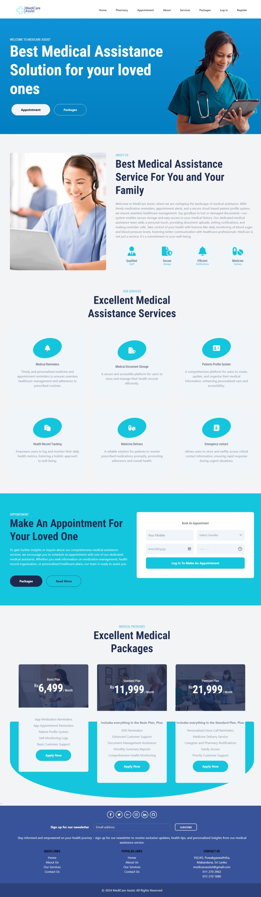
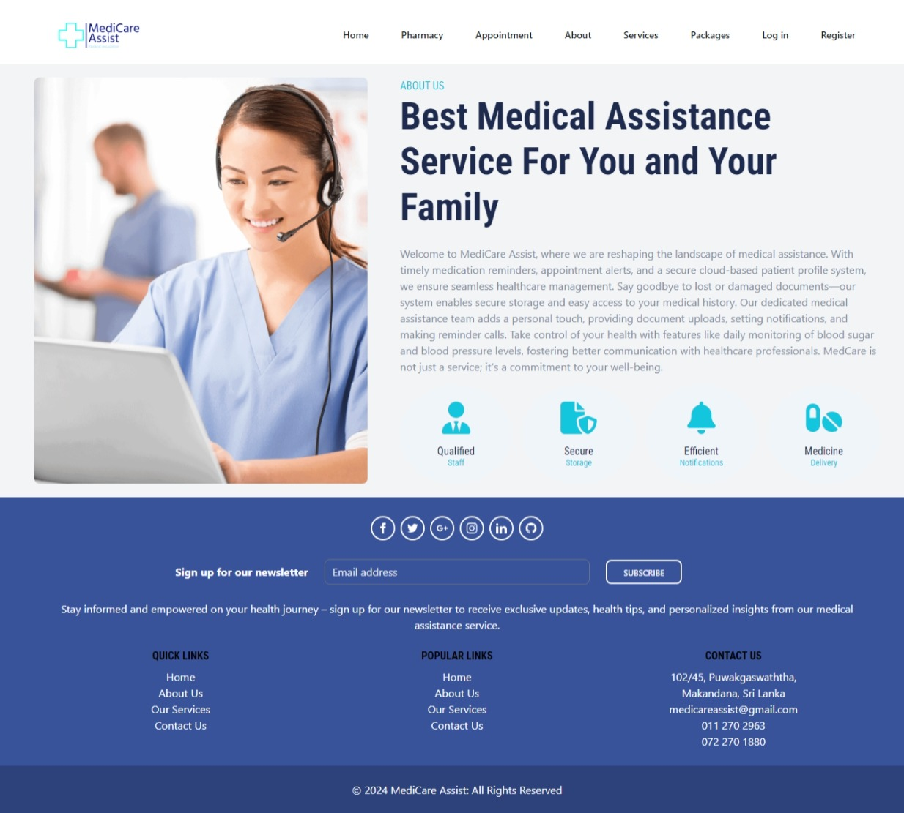
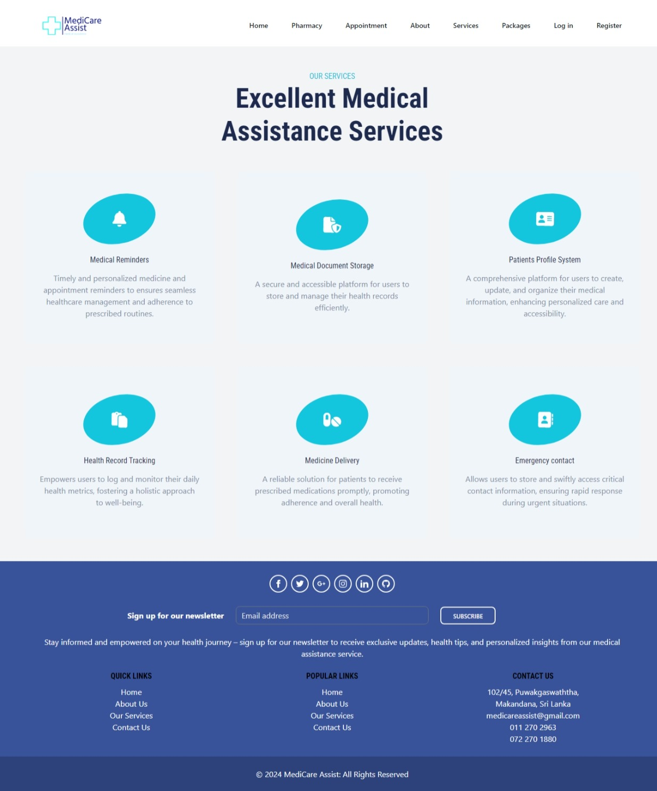
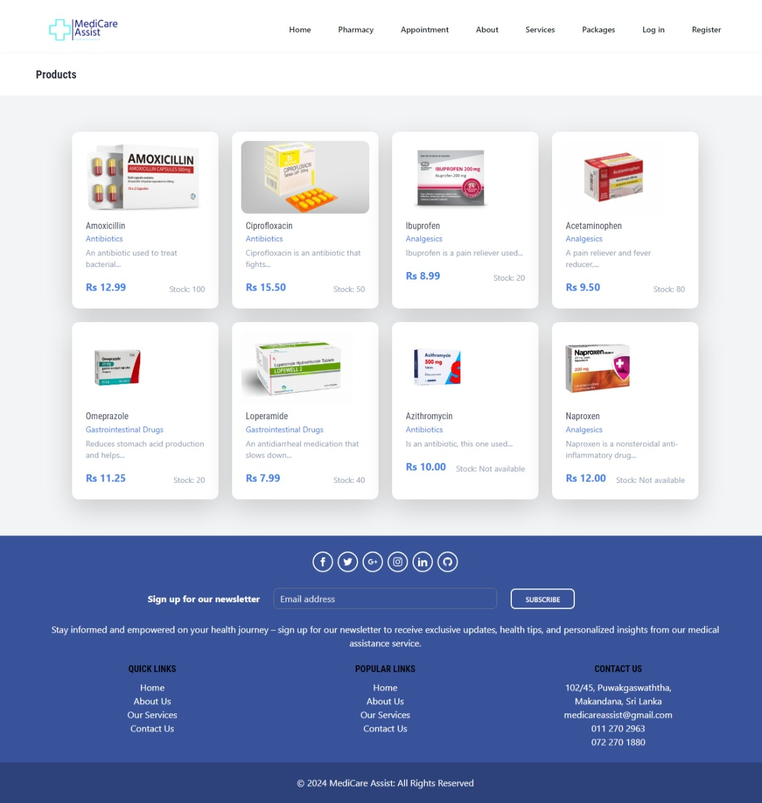
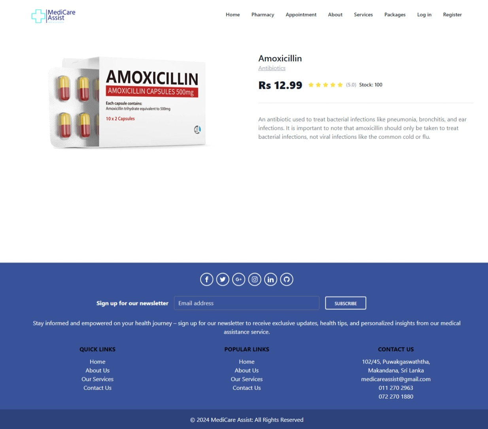
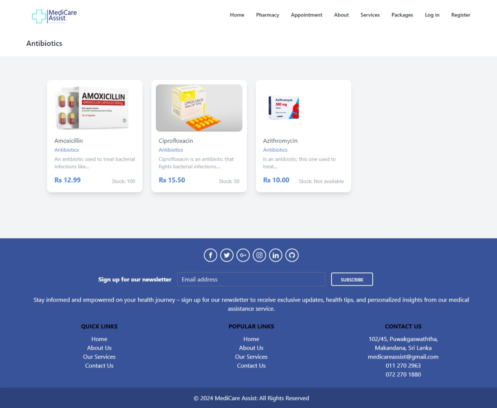
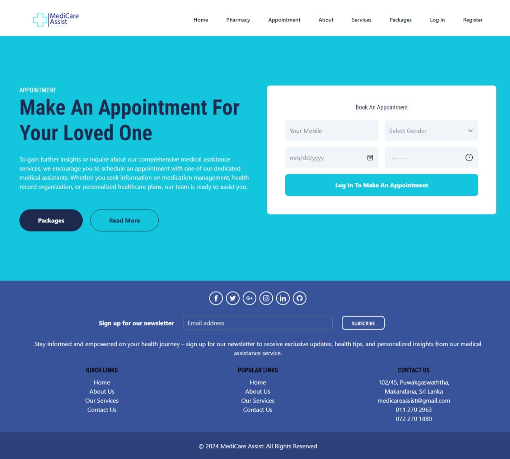
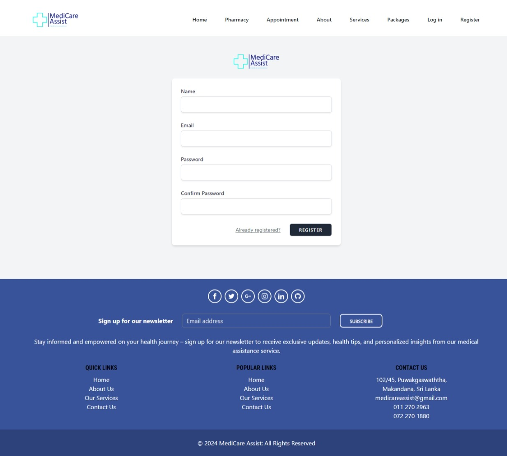
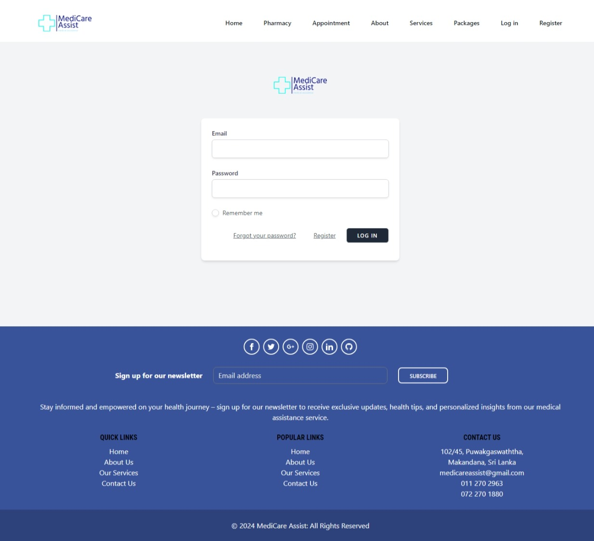

# Medicare Assist

## 1. Description

Medicare Assist is a comprehensive CRM (Customer Relationship Management) system tailored for the healthcare industry. It streamlines the management of medical appointments, medicine inventory, and patient interactions, providing an all-in-one solution for clinics, pharmacies, and healthcare providers. The system is designed to enhance efficiency by automating various administrative tasks, ensuring that healthcare providers can focus more on patient care rather than operational hassles.

Key functionalities include customer management, sales tracking, communication tools, appointment management, and detailed analytics. By centralizing these operations, Medicare Assist helps healthcare providers maintain a well-organized system that improves patient satisfaction and operational efficiency.

## 2. Features

### **Admin Features**
- **User Management**: Create, update, and manage different user roles and permissions.
- **Medicine Category Management**: Organize and manage different categories of medicines.
- **Medicine Management**: Add, edit, and track medicines within the system.
- **Stock Management**: Monitor medicine stock levels and set alerts for low inventory.
- **Appointment Management**: Oversee and manage patient appointments.
- **Analytics**: Generate reports and gain insights into the clinic's performance.

### **User Features**
- **Appointment Booking**: Patients can book, reschedule, and cancel appointments.
- **Subscription Plans**: Manage subscription plans for regular patients.
- **View Medicines**: Patients can view available medicines and their details.
- **Appointment Management**: Patients can view and manage their upcoming appointments.
- **Subscriptions Management**: Manage subscriptions, renewals, and cancellations.

## 3. Technologies Used

- **Laravel**: Backend framework used for handling the server-side logic and database interactions.
- **Blade**: Templating engine used for generating dynamic content.
- **MySQL**: Relational database used for storing and managing application data.
- **Bootstrap & Tailwind CSS**: CSS frameworks used for styling and responsive design.
- **JavaScript**: Enhances user interaction and experience with dynamic content.

## 4. Installation

To set up Medicare Assist locally or on a server, follow these steps:

1. **Prerequisites**:
   - PHP (version 7.4 or higher)
   - Composer
   - MySQL

2. **Clone the Repository**:
   ```bash
   git clone <https://github.com/your-repo/medicare-assist.git>
   cd medicare-assist
   
3. **Set Up the Environment**:
   - Copy the .env.example file to .env and update the necessary environment variables (database, mail settings, etc.).
4. **Install Dependencies**:
    ```bash
    composer install
    npm install
    npm run dev
5. **Run Migrations and Seeders**:
   ```bash
   php artisan migrate --seed
6. **Serve the Application**:
   ```bash
   php artisan serve
7. **Access the Application**:
- Open your browser and navigate to http://localhost:8000.

## 4. Configuration
- Update your .env file with the correct database credentials:

    ```dotenv
    DB_CONNECTION=mysql
    DB_HOST=127.0.0.1
    DB_PORT=3306
    DB_DATABASE=medicare_assist
    DB_USERNAME=root
    DB_PASSWORD=password

## 5. Screenshots











